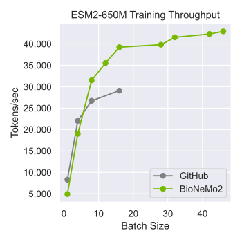
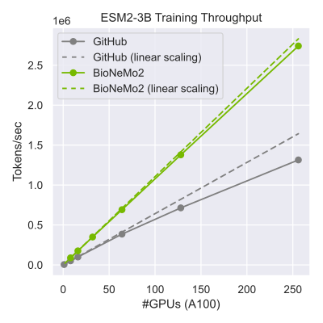

# ESM-2

## Model Overview

### Description

ESM-2 is a pre-trained, bi-directional encoder (BERT-style model) over amino acid sequences. ESM-2 models provide
embeddings for amino acids that have led to state-of-the-art performance on downstream tasks such as structure and
function prediction. ESM-2 has been trained at a number of different model sizes. BioNeMo2 includes converted
checkpoints for the 650M and 3B parameter variants. The 650M model has 33 layers, 20 attention heads, and a hidden space
dimension of 1280. The 3B model has 36 layers, 40 attention heads, and a hidden space dimension of 2,560.

These models are ready for commercial use.

### Third-Party Community Consideration

This model is not owned or developed by NVIDIA. This model has been developed and built to a third-party’s requirements
for this application and use case [1]; see link to [Non-NVIDIA Model Card for ESM-2 3B model](
    https://huggingface.co/facebook/esm2_t36_3B_UR50D) and [non-NVIDIA Model Card for ESM-2 650M model](
        https://huggingface.co/facebook/esm2_t33_650M_UR50D)

### References

[1] Lin, Z., Akin, H., Rao, R., Hie, B., Zhu, Z., Lu, W., Smetanin, N., Verkuil, R., Kabeli, O., Shmueli, Y. and dos
Santos Costa, A., 2023. Evolutionary-scale prediction of atomic-level protein structure with a language model. Science,
379(6637), pp.1123-1130.

[2] "UniProt: the universal protein knowledgebase in 2021." Nucleic acids research 49, no. D1 (2021): D480-D489.

[3] Devlin, J., Chang, M.W., Lee, K. and Toutanova, K., 2018. Bert: Pre-training of deep bidirectional transformers for
language understanding. arXiv preprint arXiv:1810.04805.

### Model Architecture

**Architecture Type:** BERT

**Network Architecture:** ESM-2

### Input

**Input Type(s):** Text (Protein Sequences)

**Input Parameters:** 1D

**Other Properties Related to Input:** Protein sequence represented as a string of canonical amino acids, of maximum
length 1022. Longer sequences are automatically truncated to this length.

### Output

**Output Type(s):** Embeddings (Amino-acid and sequence-level)

**Output Parameters:** 1D

**Other Properties Related to Output:** Numeric vector with floating-point values corresponding to an embedding for each
amino acid in the input protein sequence. Maximum output length is 1022 embeddings - one embedding vector per amino
acid.

### Software Integration

**Runtime Engine(s)**

* BioNeMo, NeMo, Megatron, TransformerEngine

**Supported Hardware Microarchitecture Compatibility**

* [Ampere]
* [Hopper]
* [Volta]

**[Preferred/Supported] Operating System(s)**

* [Linux]

### Model Version(s)

* [esm2/650m:2.0](https://catalog.ngc.nvidia.com/orgs/nvidia/teams/clara/models/esm2nv650m)
* [esm2/3b:2.0](https://catalog.ngc.nvidia.com/orgs/nvidia/teams/clara/models/esm2nv3b)

## Training & Evaluation

### Training Dataset

Original ESM-2 checkpoints from HuggingFace were trained with the UniProt 2021_04 sequence database. For more details on
the training dataset, see Lin *et al.* 2023. The train / test splits used by the original authors were not distributed.
A pre-training database compiled by NVIDIA following a similar approach is described in [UniProt
Dataset](../datasets/uniprot.md).

### Inference

**Engine:** BioNeMo, NeMo

**Test Hardware**

* [Ampere]
* [Hopper]
* [Volta]

## License

ESM-2 is as provided under the Apache 2.0 license.

## Competitive Benchmarking

### Accuracy

A validation set of 328,360 UniRef50 representative sequences were randomly selected from UniRef 2024_03 (see [UniProt
Dataset](../datasets/uniprot.md)). This validation set was used to ensure that the output of BioNeMo-converted
checkpoints is consistent with their outputs when evaluated with the HuggingFace Transformers library.

| Checkpoint | HuggingFace | BioNeMo2 | Lin *et al.* 2023                    |
| ---------- | ----------- | -------- | ---------------------                |
| 650M       |  7.001      |  7.002   | 6.95 :material-information-outline:  |
| 3B         |  6.003      |  6.004   | 6.49 :material-information-outline:  |

!!! info "Different Validation Sets"

    The HuggingFace and converted BioNeMo2 checkpoints were evaluated on a newly curated validation set. Perplexities
    from Lin *et al.* 2023 are reported for comparison, but the original train/test splits are not available.

### Training Performance

#### Single-node Training Performance

The pure-pytorch baseline (compiled with `torch.compile()`) raised an out-of-memory error for batch sizes larger than 16
at the ESM2-650M model size. The `bionemo2` model could handle batch sizes of 46, reaching a model flops utilization of
59.2% on an NVIDIA A100.

#### Model Scaling

Training ESM-2 at the 650M, 3B, and 15B model variants show improved performance with the BioNeMo2 framework over the
pure-pytorch baseline. These experiments were conducted on 16x NVIDIA A100 or 16x NVIDIA H100 GPUs split across two
nodes. **Note:* 15B model variants were trained on 64 GPUs with the BioNeMo2 framework.

#### Device Scaling

Training ESM-3B on 256 NVIDIA A100s on 32 nodes achieved 96.85% of the theoretical linear throughput expected from
extrapolating single-node (8 GPU) performance, representing a model flops utilization of 60.6% at 256 devices.
